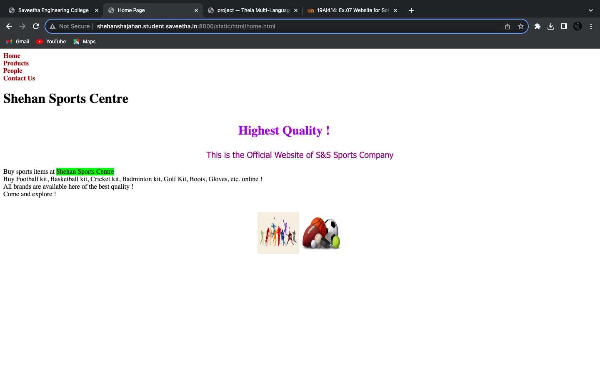
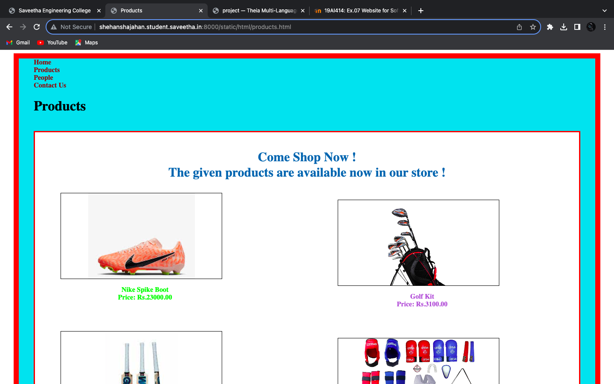
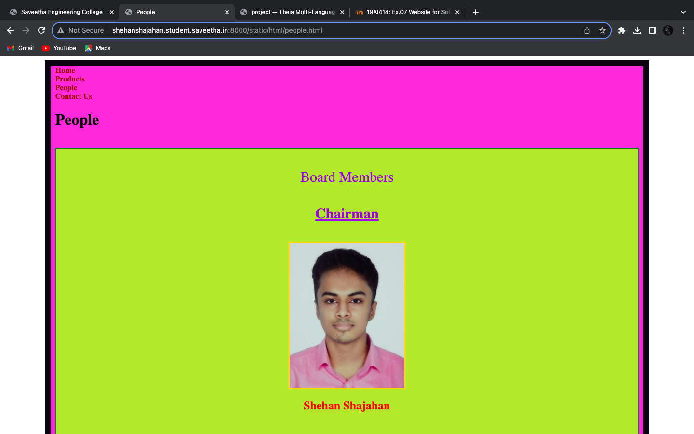
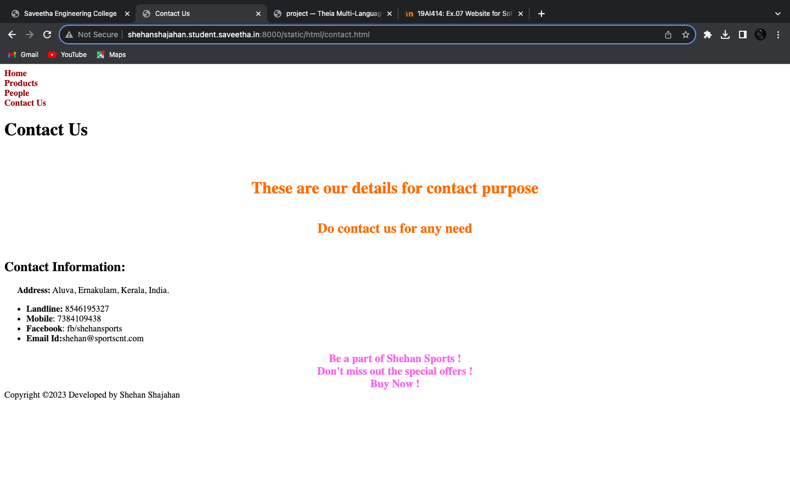
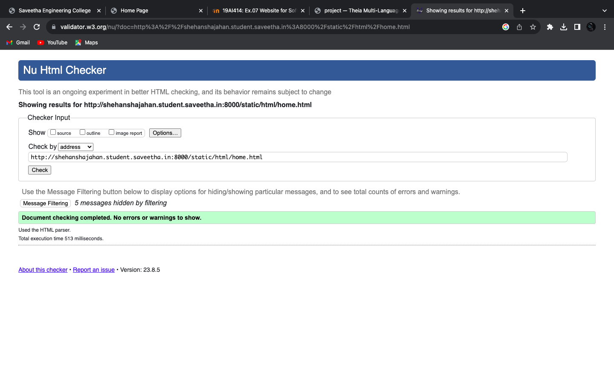

# Web Design for a Software Product Company

## AIM:

To design a static website for a software product company company.

## DESIGN STEPS:

### Step 1:

Requirement collection.

### Step 2:

Creating the layout using HTML and CSS.

### Step 3:

Updating the sample content.

### Step 4:

Choose the appropriate style and color scheme.

### Step 5:

Validate the layout in various browsers.

### Step 6:

Validate the HTML code.

### Step 6:

Publish the website in the given URL.

## PROGRAM :

```

home.html

<!DOCTYPE html>
<html lang="en">
    <head>
        <title>
            Home Page
        </title>
        <meta name="viewport" 
         content="width=device-width, initial-scale=1.0">
        <link rel="stylesheet" href="/static/CSS/style.css">
    <style>
    .text{
        color:blueviolet;
        font-family:'Lucida Sans';
        font-size: 30px;
        text-align:center;
    }
    img{
        height: 100px;
        width: 100px;
        align-items:center;
    }
    </style>

    </head>
    <body>
        <div class="home">
            <div class="header">
                <header>
                    <div class=logo></div>
                    <div class=h>
                    <a href="home.html" title="Home" style="color: darkred; text-decoration: none;"><b>Home</b></a></div>
                    <div class="prod">
                        <a href="products.html" title="Products" style="color: darkred; text-decoration: none;"><b>Products</b></a>
                    </div>
                    <div class="people">
                        <a href="people.html" title="People" style="color:darkred; text-decoration: none;"><b>People</b></a>
                    </div>
                    <div class="contact">
                        <a href="contact.html" title="Contact Us" style="color:darkred; text-decoration: none;"><b>Contact Us</b></a>
                    </div>
                </header>
                <div class="title">
                    <h1>Shehan Sports Centre</h1>
                </div><br>
                <div class="content">
                    <div class="text">
                    <marquee><b> Highest Quality ! </b></marquee>
                    <p style="color:purple; font-family:'Tahoma'; font-size:20px;"> This is the Official Website of S&S Sports Company</p>
                    </div>
                    <p>Buy sports items at <span style="background-color:lime">Shehan Sports Centre</span>
                        <br>
                        Buy Football kit, Basketball kit, Cricket kit, Badminton kit, Golf Kit, Boots, Gloves, etc. online !
                        <br>
                        All brands are available here of the best quality !
                        <br>
                        Come and explore !</p>
                    <br>
                <center>
                    
                    
                </center>
                </div>
                <div class="footer">
                <footer style="color:white">
                Copyright &copy;2023 Developed by Shehan Shajahan</footer></div>
            </div>
        </div>
    </body>
</html>

products.html

<!DOCTYPE html>
<html lang="en">
  <head>
    <title>EduSoft Private Limited</title>
    <link rel="stylesheet" href="./css/layout.css" />
    <link rel="icon" href="./img/icon.png" type="image/x-icon" />
  </head>

  <body>
    <div class="container">
      <div class="banner">EduSoft Private Limited.</div>
      <div class="menu">
        <div class="menuitem"><a href="/static/home.html">Home</a></div>
        <div class="menuitemselected">
          <a href="/static/products.html">Products</a>
        </div>
        <div class="menuitem"><a>People</a></div>
        <div class="menuitem"><a>Contact Us</a></div>
      </div>
      <div class="content">
        <div class="productcontent">    
          <h1>Our Premium Products</h1>
          <div class="productitems">
              <div class="productitem"> 
                  <div class="itemimage">
                  
                  </div>
                  <div class="itemname">Tally Gold</div>
                  <div class="itemprice">Price: Rs.40,000.00 </div>
              </div>
              <div class="productitem"> 
                  <div class="itemimage">
                  
                  </div>
                  <div class="itemname">Tally Silver</div>
                  <div class="itemprice">Price: Rs.10,000.00 </div>
              </div>
          </div>
          </div>        
      </div>
      <div class="footer">
        Copyright &#169; 2021 EduSoft Private Limited, Developed by Obed Otto.
      </div>
    </div>
  </body>
</html>

people.html

<!DOCTYPE html>
<html lang="en">
    <head>
        <title>
            People
        </title>
        <meta name="viewport" content="width=device-width, initial-scale=1.0">
        <link rel="stylesheet" href="/static/CSS/style.css">
        <style>
        .home{
            height: 3000px;
            width: 85%;
            border: 12px solid rgb(9, 4, 17);
            padding-left:10px;
            padding-right:10px;
            margin-left: auto;
            margin-right:auto;
            background-color:rgba(253, 7, 212, 0.842);
        }
        .text{
        color:blueviolet;
        font-family:'Lucida Sans';
        font-size: 30px;
        text-align:center;
        
        }
        .content{
            border:2px solid green;
            background-color:rgb(192, 223, 58);
            width:98%;
            height:2690px;
            padding:10px;
            margin-left:auto;
            margin-right:auto;
        }
        .ceoph{
            background-image: url(/static/img/shehan.jpg);
            background-size: 250px;
            background-position-x: center;
            background-repeat: no-repeat;
            border:3px solid gold;
            height:300px;
            width:20%;
            position:relative;
            left: 0px;
            margin-left:auto;
            margin-right: auto;
        }
        .ceo{
            color: red;
            position:relative;
            text-align:center;
            
            
        }
        .manph1{
            background-image: url(/static/img/ryan.jpeg);
            background-size: 250px;
            background-position-x: center;
            background-repeat: no-repeat;
            border:1px solid black;
            height:300px;
            width:20%;
            position:relative;
            margin-left:auto;
            margin-right:auto;            
        }
        .man1{
            color: red;
            position:relative;
            text-align:center;
            
        }
        .manph2{
            background-image: url(/static/img/julie.jpeg);
            background-size: 250px;
            background-position-x: center;
            background-repeat: no-repeat;
            border:1px solid black;
            height:300px;
            width:20%;
            position:relative;
            margin-left:auto;
            margin-right:auto;

            
        }
        .man2{
            color: red;
            position:relative;
            text-align:center;
        }
        
        .amph1{
            background-image: url(/static/img/tom.jpeg);
            background-size: 250px;
            background-position-x: center;
            background-repeat: no-repeat;
            border:1px solid black;
            height:300px;
            width:20%;
            position:relative;
            margin-left:auto;
            margin-right:auto;

            
        }
        .am1{
            color: red;
            position:relative;
            text-align:center;
        }

        .amph2{
            background-image: url(/static/img/malik.jpeg);
            background-size: 250px;
            background-position-x: center;
            background-repeat: no-repeat;
            border:1px solid black;
            height:220px;
            width:20%;
            position:relative;
            margin-left:auto;
            margin-right:auto;

            
        }
        .am2{
            color: red;
            position:relative;
            text-align:center;
        }
        .amph3{
            background-image: url(/static/img/vladimir.jpeg);
            background-size: 250px;
            background-position-x: center;
            background-repeat: no-repeat;
            border:1px solid black;
            height:250px;
            width:20%;
            position:relative;
            margin-left:auto;
            margin-right:auto;

            
        }
        .am3{
            color: red;
            position:relative;
            text-align:center;
        }
        </style>
    </head>
    <body>
        <div class="home">
            <div class="header">
                <header>
                    <div class=logo></div>
                    <div class=h>
                    <a href="home.html" title="Home" style="color: darkred; text-decoration: none;"><b>Home</b></a></div>
                    <div class="prod">
                        <a href="products.html" title="Products" style="color: darkred; text-decoration: none;"><b>Products</b></a>
                    </div>
                    <div class="people">
                        <a href="people.html" title="People" style="color:darkred; text-decoration: none;"><b>People</b></a>
                    </div>
                    <div class="contact">
                        <a href="contact.html" title="Contact Us" style="color:darkred; text-decoration: none;"><b>Contact Us</b></a>
                    </div>
                </header>
                <div class="title">
                    <h1>People</h1>
                </div><br>
                <div class="content">
                    <div class="text">
                    <p>Board Members</p>
                    <h4><u>Chairman</u></h4>
                    </div>
                    <div class="ceoph"></div>
                    <div class="ceo"><p align="center"><b><h2>Shehan Shajahan</h2></b></div>
                    <br>
                    <div class="text">
                        <p><b><u>Head executives</u></b></p><br>
                    </div>
                    <div class="manph1"></div>
                    <div class="man1"><p align="center"><b><h2>Ryan</h2></b></p></div>
                    <div class="manph2"></div>
                    <div class="man2"><p><b><h2>Julie</h2></b></p></div>
                    <br>
                    <div class="text"><p><b><u>Managers</u></b></p></div><br>
                    <div class="amph1"></div>
                    <div class="am1"><p align="center"><b><h2>Tom</h2></b></p></div>
                    <div class="amph2"></div>
                    <div class="am2"><p align="center"><b><h2>Malik</h2></b></p></div>
                    <div class="amph3"></div>
                    <div class="am3"><p align="center"><b><h2>Vladimir</h2></b></p></div><br>
                    <div class="text">Thank you so much for your kind support!<br>Hope our products had made you Happy and Satisfied !</div>
                </div>
                <div class="footer">
                <footer style="color:white">
                Copyright &copy;2023 Developed by Shehan Shajahan</footer></div>
            </div>
        </div>
    </body>
</html>

contact.html

<!DOCTYPE html>
<html lang="en">
    <head>
        <title>
            Contact Us
        </title>
        <meta name="viewport" 
         content="width=device-width, initial-scale=1.0">
        <link rel="stylesheet" href="/static/CSS/style.css">
    <style>
    .text{
        color:rgb(241, 120, 7);
        font-family:'Lucida Sans';
        font-size: 30px;
        text-align:center;
    }
    
    </style>

    </head>
    <body>
        <div class="home">
            <div class="header">
                <header>
                    <div class=logo></div>
                    <div class=h>
                    <a href="home.html" title="Home" style="color: darkred; text-decoration: none;"><b>Home</b></a></div>
                    <div class="prod">
                        <a href="products.html" title="Products" style="color: darkred; text-decoration: none;"><b>Products</b></a>
                    </div>
                    <div class="people">
                        <a href="people.html" title="People" style="color:darkred; text-decoration: none;"><b>People</b></a>
                    </div>
                    <div class="contact">
                        <a href="contact.html" title="Contact Us" style="color:darkred; text-decoration: none;"><b>Contact Us</b></a>
                    </div>
                </header>
                <div class="title">
                    <h1>Contact Us</h1>
                </div><br>
                <div class="content">
                    <div class="text">
                    <p><b>These are our details for contact purpose
                    <h5>Do contact us for any need
                    
                    </h5></b></p>
                    
                    </div>
                    <b><h2>Contact Information:</h2></b>
                    <p><b>&emsp;&ensp;Address:</b>
                        Aluva, Ernakulam, Kerala, India.
                    </p>
                    <ul>
                        <li><b>Landline:</b> 8546195327 </li>
                        <li><b>Mobile</b>: 7384109438 </li>
                        <li><b>Facebook</b>: fb/shehansports </li>
                        <li><b>Email Id:</b>shehan@sportscnt.com</li>
                    </ul>
                    <div style="text-align: center;color:violet;font-size:20px;"><b>Be a part of Shehan Sports !
                        <br>
                        Don't miss out the special offers !
                        <br>
                        Buy Now !
                    </b></div>

                </div>
                <div class="footer">
                <footer style="color:rgb(8, 2, 2)">
                Copyright &copy;2023 Developed by Shehan Shajahan</footer></div>
            </div>
        </div>
    </body>
</html>

styles.css

.home{
            height: 700px;
            width: 85%;
            border: 12px solid red;
            padding-left:10px;
            padding-right:10px;
            margin-left: auto;
            margin-right:auto;
            background-color:cyan;
        }
        .content{
            border:1px solid whitesmoke;
            background-color: white;
            width:95%;
            height:1190px;
            padding:10px;
            margin-left:auto;
            margin-right:auto;
        }
        .header{
            height: 128px;
            width:100%;
            background-image: url(/static/images/background.jpg);
            background-size: cover;
            
        }
        .logo{
            height:18%;
            width: 10%;
            position:absolute;
            background-image: url(/static/images/logo2.png);
            background-size:cover;
            
        }
        .prod{
            height:auto;
            width:auto;
            position:relative;
            bottom:10px;
            left:550px;
            border:4px solid transparent;
            text-align:center;
            display: inline;
            padding:15px;
            font-family:'Gill Sans MT';
            font-size: large;  
        }
        .prod:hover{
            background-color:red;
        }
        .people{
            height:auto;
            width:auto;
            position:relative;
            bottom:10px;
            left:700px;
            border:4px solid transparent;
            text-align:center;
            display: inline;
            padding:15px;
            font-family:'Gill Sans MT';
            font-size: large;  
        }
        .people:hover{
            background-color:red;
        }
        .contact{
            height:20px;
            width:10%;
            position:relative;
            bottom:45px;
            left:1000px;
            border:4px solid transparent;
            text-align:center;
            padding:15px;
            font-family:'Gill Sans MT';
            font-size: large;  
        }
        .contact:hover{
            background-color:red;
        }
                
        .h{
            height:20px;
            width:10%;
            position:relative;
            top:30px;
            left:200px;
            border:4px solid transparent;
            text-align:center;
            
            padding:15px;
            font-family:'Gill Sans MT';
            font-size: large;  
        }
        .h:hover{
            background-color:red;
            overflow:hidden;
        }
        .footer{
            border: 15px solid red;
            width:98%;
            height:10px;
            position:relative;
            bottom: 1px;
            background-color:red;
            text-align:center;

        }
        .title{
            border:2px solid pink;
            background-color:yellow;
            padding:1px;
            width:99.7%;
            height: 70px;
            text-align:center;
            font-family:'Impact';
            margin-left:auto;
            margin-right: auto;
            
        }
        .content{
            border:1px solid red;
            background-color: white;
            width:98%;
            height:400px;
            padding:10px;
            margin-left:auto;
            margin-right:auto;

        }
```
## OUTPUT:





## HTML VALIDATOR:


### Home Page:


## Result:

Thus a website is designed for the software product company and the HTML,CSS code are validated.
